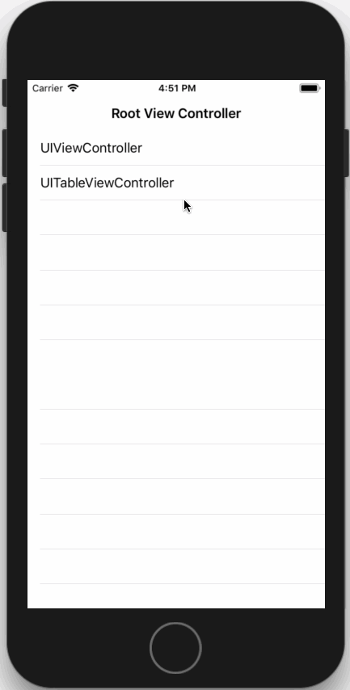

# InteractivePushGesture

[]()
[]()
[]()
[]()

> 只提供push功能，pop还是使用系统原生的手势

通过左滑手势push控制器

## 环境要求

- iOS8.0+
- Xcode9.3+

## 演示

[]()

## 用法

- 将 `UIViewController+InteractivePushGesture.{h/m}` 文件拖入项目
- 在控制器的viewDidLoad中启用push手势并设置代理(可在Storyboard中设置)
```ObjC
self.interactivePushGestureEnabled = YES;
self.interactivePushGestureDelegate = self;
```
- 实现代理方法返回需要push的控制器
```ObjC
- (UIViewController *)destinationViewControllerFromViewController:(UIViewController *)fromViewController {
    UIViewController *vc = [[UIViewController alloc] init];
    vc.view.backgroundColor = [UIColor redColor];
    return vc;
}
```

## 协议

被许可在 MIT 协议下使用，查阅`LICENSE`文件来获得更多信息。
